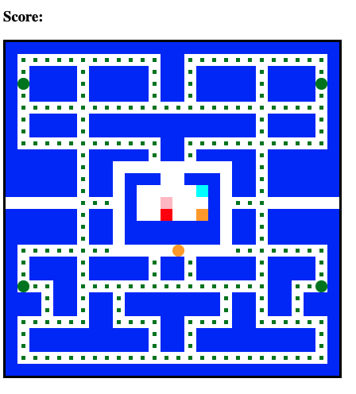
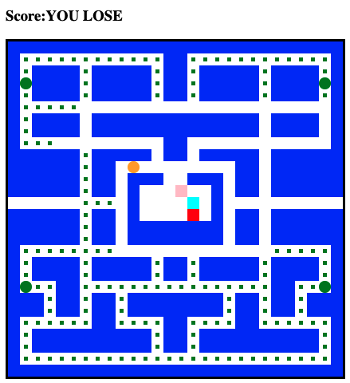
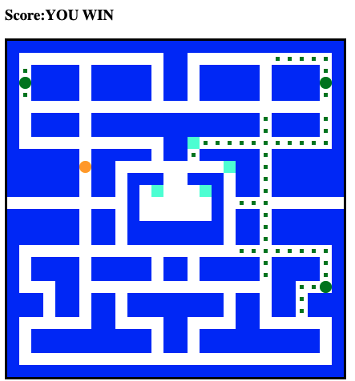

# Scrimba Frontend Career Path - (Pacman - Module 06)

This is a solution to the [Scrimba Frontend Career Path - (Module 06/Pacman game)](https://scrimba.com/learn/frontend).

## Table of contents

- [Overview](#overview)
  - [The challenge](#the-challenge)
  - [Screenshot](#screenshot)
  - [Links](#links)
- [My process](#my-process)
  - [Built with](#built-with)
  - [What I learned](#what-i-learned)
  - [Continued development](#continued-development)
  - [Useful resources](#useful-resources)
- [Author](#author)
- [Acknowledgments](#acknowledgments)


## Overview

### The challenge

Make a pacman game

Users should be able to Code/Understand:

- addEventListener()
- getElementById()
- querySelector()
- length
- createElement()
- appendChild()
- push()
- classList.add()
- classList.remove()
- leyCode
- classList.contain()
- innerHTML
- setTimeout()
- forEach()
- class
- this
- constructor()
- setInterval()
- Math.floor()
- Math.random()

### Screenshot





### Links

- Solution Github URL: [https://github.com/Rod-Barbosa/pacman](https://github.com/Rod-Barbosa/pacman)
- Live Site URL: [https://rodrigo-pacman.netlify.app/](https://rodrigo-pacman.netlify.app/)
- You win the game at 274 points. Big balls are worth 10pts. Ghosts are worth 100pts. Maybe I'll chang eit in the future, but for now... it is what it is

## My process

### Built with

- Semantic HTML5 markup
- CSS
- JavaScript


### What I learned

The new way of capturing keypresses works with returned values like strings: "ArrowUp" instead of values like 39. It is a combination of listening to "keydown" events and using the e.key property
```javascript
document.addEventListener("keydown", control)
function control(e){
    console.log(e.key)
    switch (e.key){
        case "ArrowDown":
            //code here
        break;
        case "ArrowUp":
            //code here
        break;
        case "ArrowLeft":
            //code here
        break;
        case "ArrowRight":
            //code here
        break;
        default:
        return;
    }
```
The function moveghost it the MVP of this project

```javascript
function moveGhost(ghost){
    console.log("moved ghost")
    const directions = [-1, +1, -width, +width]
    let direction = directions[Math.floor(Math.random() * directions.length)]
    console.log(direction)

    ghost.timerId = setInterval(function(){

        //respect walls and respect ghosts
        if( 
            !squares[ghost.currentIndex + direction].classList.contains("wall") &&
            !squares[ghost.currentIndex + direction].classList.contains("ghost")
        ){
            //remove any ghost
            squares[ghost.currentIndex].classList.remove(ghost.className)
            squares[ghost.currentIndex].classList.remove("ghost", "scared-ghost")
            //add direction to current Index
            ghost.currentIndex += direction
            //add ghost class
            squares[ghost.currentIndex].classList.add(ghost.className)
            squares[ghost.currentIndex].classList.add("ghost")
        } else {direction = directions[Math.floor(Math.random() * directions.length)]}

        //if the ghost is currently scared
        if(ghost.isScared){
            squares[ghost.currentIndex].classList.add("scared-ghost")
        }

        //if the ghost is currently scared and pacman is on it
        if(ghost.isScared && squares[ghost.currentIndex].classList.contains("pacman")){
            //remove classname - ghost.className, ghsot, scared-ghost
            squares[ghost.currentIndex].classList.remove(ghost.className, "ghost", "scared-ghost")
            //cahnge ghost currentIndex back to its statsIndex
            ghost.currentIndex = ghost.startIndex
            //add a score of 100
            score +=100
            scoreDisplay.innerHTML=score
            //readd classnames of ghos.className and ghost to the ghosts new position
            squares[ghost.currentIndex].classList.add(ghost.className, "ghost")
        }
        checkGameOver()
    }, ghost.speed)

}
```
Ghosts move around randomly like this:
Pic a direction at random from a directions array (up, down, left or right)
Check for walls or other ghosts(so they don't eat each other)
If the square they are movin to is clear, the ghost class gets romoved from last place, and placed on next square

```Javascript
    const directions = [-1, +1, -width, +width]
    let direction = directions[Math.floor(Math.random() * directions.length)]
    ghost.timerId = setInterval(function(){

        //respect walls and respect ghosts
        if( 
            !squares[ghost.currentIndex + direction].classList.contains("wall") &&
            !squares[ghost.currentIndex + direction].classList.contains("ghost")
        ){
            //remove any ghost
            squares[ghost.currentIndex].classList.remove(ghost.className)
            squares[ghost.currentIndex].classList.remove("ghost", "scared-ghost")
            //add direction to current Index
            ghost.currentIndex += direction
            //add ghost class
            squares[ghost.currentIndex].classList.add(ghost.className)
            squares[ghost.currentIndex].classList.add("ghost")
        } else {direction = directions[Math.floor(Math.random() * directions.length)]}

```
Every ghost has their own speed. So timerId gets called depending on that. The only behaviour I am not happy with at the moment is that checkGameOver() only gets called after a ghost moves. That mean that in order to lose the game, pacman has to wait for the ghost on top of him to move. At the moment I can move at lightining speed compared to the ghosts. Maybe in the future a simple speed up would get rid of it. But as it stands, you have to sit in place to lose.

```javascript        
    ghost.timerId = setInterval(function(){
    .
    .
    .
//if the ghost is currently scared and pacman is on it
        if(ghost.isScared && squares[ghost.currentIndex].classList.contains("pacman")){
            //remove classname - ghost.className, ghsot, scared-ghost
            squares[ghost.currentIndex].classList.remove(ghost.className, "ghost", "scared-ghost")
            //cahnge ghost currentIndex back to its statsIndex
            ghost.currentIndex = ghost.startIndex
            //add a score of 100
            score +=100
            scoreDisplay.innerHTML=score
            //readd classnames of ghos.className and ghost to the ghosts new position
            squares[ghost.currentIndex].classList.add(ghost.className, "ghost")
        }
        checkGameOver()
    }, ghost.speed)
```

### Continued development

Maybe in the future I'll make the ghosts chase pacman, instead of just wlaking randomly. Also, making them leave the pit faster? Or even adding music/sound effects. But I am not a AAA studio.


### Useful resources

- [e.key](https://developer.mozilla.org/en-US/docs/Web/API/KeyboardEvent/key) - New format for capturing keypresses and controll pacman with the keyboard arrows


## Author

- Website - [Rodrigo Portfolio](https://www.gelatodigital.com)
- Frontend Mentor - [@Rod-Barbosa](https://www.frontendmentor.io/profile/Rod-Barbosa)
- Github - [@Rod-Barbosa](https://github.com/Rod-Barbosa)

## Acknowledgments

